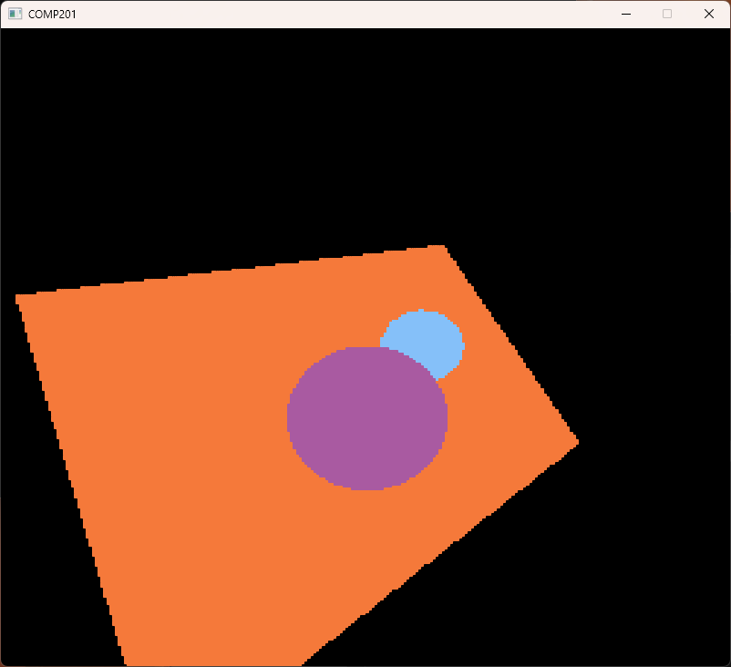
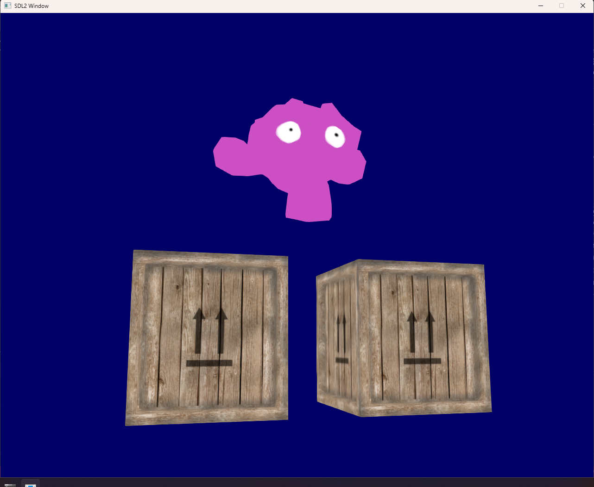

I am a games programmer, designer and VFX artist with experience in using Unity and Unreal Engine. I have been using Unity since 2017 and have experience with a number of popular external packages for Unity, like Photon Unity Networking.

I also have experience outside of games development as a programmer, having worked on some graphics programming tasks, like a raycaster for rendering 3D objects.

# Bounced Out!



In Bounced Out! go at it alone or team up with a friend to staff "The Pound", a chaotic nightclub. As bouncers: check IDs, diffuse situations, fight customers and avoid getting fired by your boss "Mad Dog".

This was my third year university group project with a team of 4 others. I played the role of the main gameplay programmer, VFX artist, animator, designer, audio designer and did some minor jobs in UI art and 3D modelling.

Bounced Out! can be found on [itch.io](https://16slaten.itch.io/bounced-out) and will soon be able to be found on steam. This game is still in ongoing development.

At Falmouth University Games Expo 2026, Bounced Out! was one of two runners up for the industry award.

# Stygian



In Stygian, play as a lost soul on the river Styx attempting to escape the afterlife and return to the mortal world.

Stygian was my second year university project in a team of 8 people. I played similar roles as with Bounced Out! - I was the main gameplay programmer, VFX artist, animator, designer, audio designer and did some minor jobs in UI art and 3D modelling.

# Brawler Project



This project was a Brawler game style boss fight I made with inspiration from the Yakuza games. It shares features with them, like a basic implementation of the heat action function. All the assets in this project, bar animations and a number of the sound effects, were made by me.

# Simple Raycaster

This project was a 2nd year university project wherein a basic raycaster is used to render 3D models. Models are limited to being in a solid colour with no shading. This method of rendering needs to be relatively low resolution for performance reasons.

# OpenGL Renderer

This was a 3rd year university project in which OpenGL was used to render 3D models with textures. In this case, the models were a cube with a crate texture and a blender monkey with a very simple drawn texture for testing. Models are limited to only the basic texture without a normal map or specular map in this case. This also lacks the ability to use shading, the enviornment is rendered with every object fully lit.
